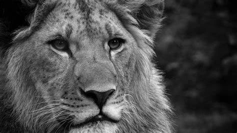
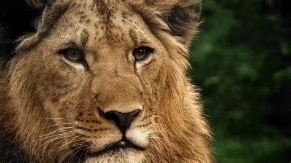

# Image Colorization
 
## Description

This project aims to implement an image colorization algorithm using deep learning techniques.

## Features

- Convert grayscale images to colorized images
- Support for various image formats (e.g., JPEG, PNG)
- User-friendly interface using `Streamlit`, a simple web app framework for Python

## Installation

1. Clone the repository:

    ```bash
    git clone https://github.com/NithinHD/Image-colorization.git
    ```

2. Install the required dependencies:

    ```bash
    pip install -r requirements.txt
    ```

## Usage

1. Navigate to the project directory:

    ```bash
    cd Image-Colorization
    ```

2. Run the colorization app:

    ```bash
    streamlit run app.py
    ```

    Open the provided URL in a web browser and follow the instructions to colorize images.

3. Run the notebook:

    ```bash
    jupyter notebook
    ```

    Open the `Image Colorization.ipynb` notebook and follow the instructions to colorize images.

## Description of the Model
- `Input Layer`:
    - This layer serves as the entry point for the input data, typically images or feature maps.
- `Convolutional Layer 1 (Conv1)`:
    - Convolution operation extracts features from the input using a set of learnable filters. ReLU activation function introduces non-linearity to the model.
    - Batch normalization normalizes the activations of the previous layer, which helps in training stability and faster convergence.
- `Convolutional Layer 2 (Conv2)`:
    - Similar to Conv1, this layer extracts higher-level features from the input.
    - ReLU activation and batch normalization are applied for non-linearity and normalization.
- `Convolutional Layer 3 (Conv3)`:
    - Another convolutional layer to further extract complex features.
    - ReLU activation and batch normalization are applied.
- `Convolutional Layer 4 (Conv4)`:
    - Continues the feature extraction process.
    - ReLU activation and batch normalization.
- `Convolutional Layer 5 (Conv5)`:
    - Further extracts features with deeper representation. 
    - ReLU activation and batch normalization.
- `Convolutional Layer 6 (Conv6)`:
    - Continues the feature extraction process. ReLU activation and batch normalization.
- `Convolutional Layer 7 (Conv7)`:
    - Extracts more abstract features.
    - ReLU activation and batch normalization.
- `Deconvolutional Layer (Conv8)`:
    - Deconvolution (also known as transposed convolution) is used for upsampling or generating feature maps with larger spatial resolutions.
    - ReLU activation is applied.
- `Softmax Layer`:
    - Softmax activation function is typically used for multi-class classification to compute probabilities for each class.
- `Convolutional Layer for Decoding (class8_ab)`:
    - This layer is used for decoding or generating output.

## Results
<p align="center">
  
  
    </p>

## Contributing

Contributions are welcome! If you find any issues or have suggestions for improvement, please open an issue or submit a pull request.

## License

This project is licensed under the MIT License. See the [LICENSE](LICENSE) file for more information.